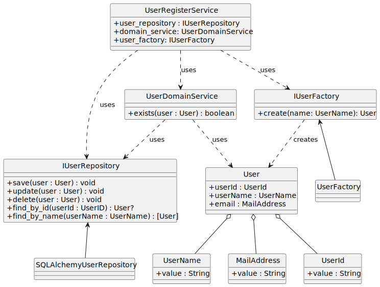

# ドメイン駆動設計(DDD)のサンプルプロジェクト

## 要求

- ユーザ管理
- グループ管理

## 仕様

- ユーザ管理
  - ユーザの登録,更新,削除
  - ユーザID,ユーザ名,メールアドレス,パスワード
  - ユーザIDは3文字以上32文字以下
  - ユーザ名は3文字以上20文字以下
  - 既存ユーザとはユーザID,メールアドレスともに重複禁止
  - [ ] パスワードは8文字以上で, {英語大文字,小文字,数字,記号}から3種以上を含む
  - プレミアムユーザ
    - [ ] ユーザ登録時に決定もしくはあとから更新
    - [ ] ただし非プレミアムに更新することでグループ人数制限が満たせなくなる場合は更新禁止
  - グループへの参加
    - [ ] ユーザ登録時もしくはあとから参加
    - 参加時にプレミアムか否かに応じたグループ人数制限を超える場合は参加禁止.

- グループ管理
  - グループの作成
  - グループ名は3文字以上20文字以下
  - グループ名の重複禁止
  - グループには参加者の中から一名グループオーナーを設定
  - グループへの参加上限人数はオーナー含めて30人
  - プレミアムユーザが10人以上所属しているグループは上限が50人に引き上げられる

### クラス図

